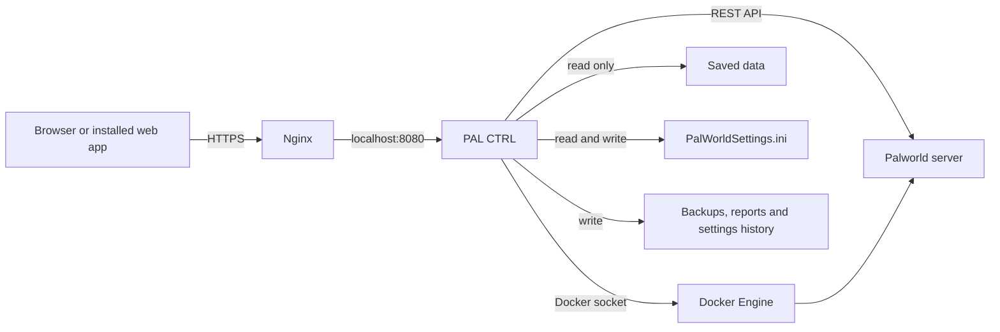

# PAL CTRL

PAL CTRL is a lightweight, self-hosted control panel for one private Palworld
dedicated server. It is designed for a small group of friends, not for a
commercial multi-server hosting platform.

The panel is a single Go process with an embedded, dependency-free web
interface. It reads Palworld's official REST API, manages the server process
through Docker or a small Windows bridge, creates backups, displays operational
metrics, and provides safe control over official Palworld settings.

## Highlights

- Live server status, FPS, frame time, uptime, CPU, memory and player count
- Rolling UDP latency and packet-loss health with degraded/critical warnings
- Persistent daily CSV reports with summaries, hourly breakdowns and downloads
- Player list with ping, level, kick and ban actions
- World saves, announcements, graceful shutdowns, restarts and updates
- Recent logs and a legacy RCON console
- ZIP backups stored outside the live save directory with storage totals and confirmed removal
- Six Game Night presets:
  - Normal Night
  - Fast XP Night
  - Breeding Night
  - Resource Farming
  - Boss Assist
  - Boss Delete
- 102 editable Palworld identity, gameplay, progression, survival, world, resource, base,
  player and performance controls
- Editable server name and simultaneous-player capacity
- Safe settings workflow with save, backup, INI snapshot, restart, health check,
  automatic recovery and one-click undo
- One shared panel password and an HttpOnly session cookie
- Responsive desktop and mobile interface
- Sample environment for testing without a real Palworld server

## Architecture



REST and RCON remain on the private Docker network. Only Nginx and the
Palworld UDP game port need to be reachable externally.

See [Architecture](docs/ARCHITECTURE.md) for component boundaries and data
flows.

## Try the complete interface

Docker Desktop or Docker Engine is required.

```powershell
docker compose -f compose.simulator.yml up -d --build
```

Open `http://127.0.0.1:8080` and sign in with the simulator password `1234`.
The simulator provides sample players, changing metrics, logs, saves, backups,
RCON responses and server lifecycle actions.

Stop it when finished:

```powershell
docker compose -f compose.simulator.yml down
```

The simulator password is intentionally simple and must not be reused for an
Internet-facing deployment.

## Production overview

The recommended Linux deployment uses:

- The official Pocketpair Palworld container
- PAL CTRL in its own container
- A private Docker network for REST and RCON
- PAL CTRL bound to `127.0.0.1:8080`
- Nginx as the HTTPS reverse proxy
- A read-only save-data mount
- A narrow read/write mount for `PalWorldSettings.ini`
- A separate writable backup directory

Start with:

1. [Deployment guide](docs/DEPLOYMENT.md)
2. [Configuration reference](docs/CONFIGURATION.md)
3. [Security guide](docs/SECURITY.md)
4. [Operations and recovery](docs/OPERATIONS.md)

Never commit `.env`, real passwords, private keys, save data or backup archives.

## Game Night settings

Palworld does not offer live REST endpoints for changing balance settings.
PAL CTRL therefore applies settings through a controlled restart:

```text
Announce -> Save world -> Create ZIP backup -> Snapshot INI
         -> Write validated settings -> Restart -> Health check
```

If Palworld does not return successfully, PAL CTRL restores the previous INI
and attempts recovery automatically. Normal Night uses a baseline captured
before the first preset.

PAL CTRL exposes official gameplay settings while deliberately excluding
passwords, public IPs, REST/RCON ports and other infrastructure fields from the
browser editor.

Pocketpair references:

- [Configuration parameters](https://docs.palworldgame.com/settings-and-operation/configuration/)
- [Administrative commands](https://docs.palworldgame.com/settings-and-operation/commands/)
- [REST API](https://docs.palworldgame.com/api/rest-api/)
- [RCON deprecation notice](https://docs.palworldgame.com/api/rcon/)

## Development

```powershell
docker run --rm -v "${PWD}:/src" -w /src golang:1.23-alpine `
  sh -c "gofmt -w *.go && go test ./... && go vet ./..."

docker build -t palctrl:local .
```

The project intentionally has no JavaScript package manager, frontend build
step or external database. Static HTML, CSS and JavaScript are embedded in the
Go executable.

See [Development](docs/DEVELOPMENT.md) for the repository layout and test
strategy.

## Documentation

- [Architecture](docs/ARCHITECTURE.md)
- [Deployment](docs/DEPLOYMENT.md)
- [Configuration](docs/CONFIGURATION.md)
- [Operations and recovery](docs/OPERATIONS.md)
- [Security](docs/SECURITY.md)
- [HTTP API](docs/API.md)
- [Development](docs/DEVELOPMENT.md)
