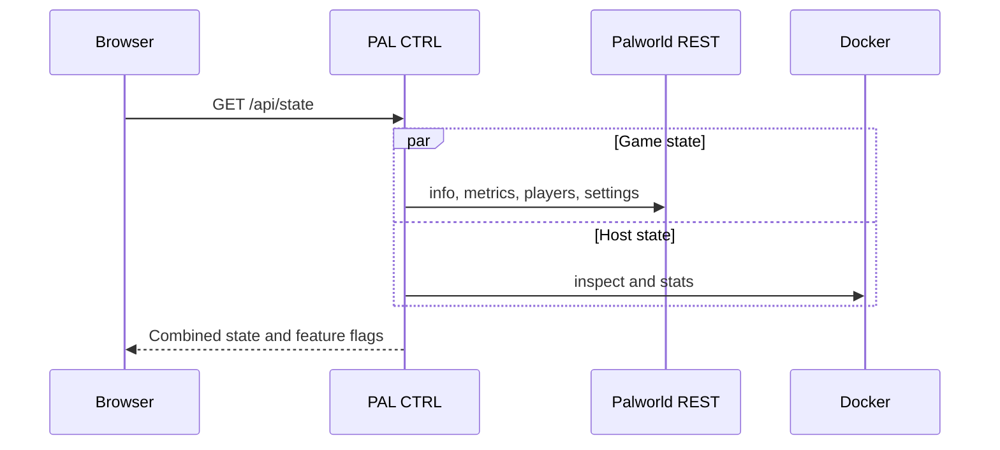
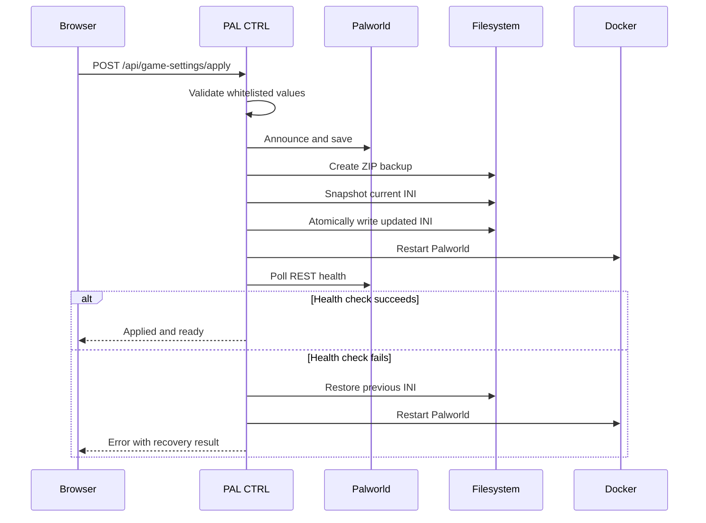

# Architecture

## Design goals

PAL CTRL is optimized for one private Palworld server and a very small trusted
group. Its architecture intentionally avoids multi-tenant hosting features such
as server provisioning, user roles, billing, plugin installation and arbitrary
shell access.

The primary goals are:

- Small operational footprint
- Minimal dependencies
- Safe server lifecycle actions
- Clear failure behavior
- Narrow filesystem permissions
- Useful mobile access
- Recoverable settings changes

## Components

### Browser interface

The interface is static HTML, CSS and JavaScript embedded in the Go binary. It
has five views:

1. Overview
2. Players
3. Console
4. Utilities
5. Game Night

The browser communicates only with same-origin `/api/*` endpoints. Mutation
requests include `X-Pal-Control: 1`, and the Content Security Policy permits
only same-origin scripts, styles, images and connections.

### PAL CTRL application

The Go process owns:

- Password authentication and the in-memory session token
- REST aggregation for server state
- A 24-hour in-memory metric history
- Rolling unprivileged UDP network probes and packet-loss classification
- Docker or native Windows lifecycle control
- ZIP backup creation
- RCON communication for the legacy console
- Official settings catalog and validation
- INI parsing, updates, snapshots and rollback
- Embedded static assets

There is no database. Restarting PAL CTRL clears only metric history and the
current login session. Palworld saves, backups and settings history live on
disk.

### Palworld REST API

PAL CTRL uses Pocketpair's REST API for:

- Server information
- Metrics
- Connected players
- Effective server settings
- Announcements
- Save requests
- Kick, ban and unban operations
- Graceful shutdown

The REST port must remain private. It is authenticated with the Palworld admin
user and password configured in PAL CTRL.

### Docker control

On Linux, PAL CTRL executes the Docker CLI through a mounted Docker socket.
This provides:

- Container status and resource statistics
- Start, stop and restart
- Logs
- Compose image updates

The Docker socket is equivalent to host-level administrative access. This is
why the panel must remain private, authenticated and bound behind a trusted
reverse proxy.

### Native Windows bridge

For a native Windows Palworld server, `native_agent.py` provides an
authenticated localhost bridge for process status, metrics, logs and lifecycle
operations. `scripts/Start-PalworldLimited.ps1` starts the process inside a
Windows Job Object with a configured memory ceiling.

### Storage boundaries

The production container uses three distinct mounts:

| Data | Container access | Purpose |
| --- | --- | --- |
| Palworld save directory | Read-only | Backups and inspection |
| `PalWorldSettings.ini` directory | Read/write | Validated settings changes |
| Backup directory | Read/write | ZIP archives, baseline and INI history |

PAL CTRL does not provide a file browser or arbitrary filesystem endpoint.

## Request flow

### Read-only state refresh

Failures from one source are reported as issues without hiding data received
from the other source.

### Network monitoring

PAL CTRL sends a small DNS query over UDP to each configured external target.
It retains a bounded rolling window per target, aggregates successful latency
and packet loss, and classifies the result as collecting, healthy, degraded or
critical. Degraded and critical states are included in the normal state issue
banner.

The monitor deliberately avoids raw ICMP so the container does not need
`NET_RAW` or extra packages. Because a server cannot observe packets dropped
before reaching its network, a separate external probe is still required for
complete player-facing monitoring.

### Settings application

## Settings model

`settings.go` contains the official editable catalog, groups, field types,
validation bounds and Game Night presets. Infrastructure fields are absent from
the catalog and therefore cannot be submitted through the settings API.

The INI parser understands:

- Quoted strings containing commas
- Nested parenthesized lists
- Booleans
- Integers and floating-point values
- Empty values
- Unknown fields that must be preserved

Only requested whitelisted keys are replaced. Server passwords, crossplay
configuration and unrecognized future Pocketpair fields remain intact.

## Authentication model

PAL CTRL uses one shared password:

1. `POST /api/login` compares the supplied password in constant time.
2. A random session token is issued as an HttpOnly, SameSite Strict cookie.
3. The token is held only in memory.
4. Restarting the panel invalidates all sessions.
5. Mutations also require the custom control header.

This model is appropriate for a tiny trusted group. It is not a replacement for
individual accounts, audit logs or role-based access control.
